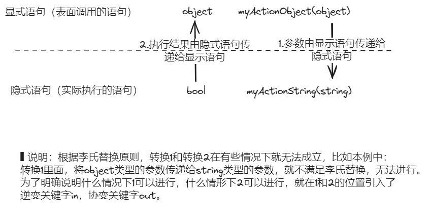

# 对协变和逆变使用原理的理解

只有泛型委托和泛型接口才有协变和逆变的情况出现；在DOTNET中目前泛型类型是不允许协变和逆变的。
- 泛型委托 ✅
- 泛型接口 ✅
- 泛型类型 ❎

## 可以出现协变逆变的场景
在宏观上同时出现以下两种情形时，出现协变逆变：
1. 从泛型定义到最后方法执行，要经过两层实例化（分别是泛型结构实例化（确定具体的类型，去掉泛型特效）和具体类型的实例化（就是使用具体的变量，调用上一步结构的实例））
2. 方法执行时，是否隐句替换显句执行，以及变量在其间往复传递。

以下分别说明。
## 两层实例化
比如如下代码：
```cs
//定义泛型委托
public delegate P MyActionWithParam<T,P>(T param);

//通过指定具体的类型对泛型委托实例化
MyActionWithParam<object> myActionObject = new MyActionWithParam<object>(Utils.DealInput<object>);
MyActionWithParam<string> myActionString = new MyActionWithParam<string>(Utils.DealInput<string>);

//调用实例化后的具型委托（就是普通方法）
myActionObject(123);
myActionObject(true);
myActionString("China");
```
1. 在实例化泛型委托时，`new MyActionWithParam<object>`、`new MyActionWithParam<string>`是通过传递具体类型来实例化泛型结构；得到的是一个具体类型的方法。
2. 在调用实例化后的委托实例（就是方法，此时的方法不再是泛型的方法，而是具体类型的方法）时，传入的`123`、`true`、`"China"`是在对具体的类型（此时已经不是泛型的类型了）`objecct`、`string`进行实例化。

## 显式语句和隐式语句的执行跳转
泛型结构经过第一步的实例化得到一种具体类型的结构（本例中是将泛型的委托实例化为带有具体类型的方法，`MyActionWithParam<object> myActionObject = new MyActionWithParam<object>(Utils.DealInput<object>)`，myActionObject就是一个使用object类型参数的方法），接在直接执行方法的化，在第二步传递具体类型的实例（就是变量）给方法时仅需要考虑变量的李氏替换原则，此时就不涉及显示语句和隐式语句调整的问题。

但是，如果泛型结构在第一步实例化出了两种具体类型的结构（`myActionObject`，`myActionString`），在调用前，如果将这两种实例化后的结构互相赋值的话再调用方法，就涉及显式/隐式语句跳转的问题。比如：
```cs
//1. 经过第一步实例化后的泛型结构相互赋值(如果可行的话)
myActionObject = myActionString；
//或者
//myActionString = myActionObject；

//2. 然后进行方法调用
myActionObject("China")
```
此时明面上是调用（显式执行语句）的myActionObject(),实际是调用（隐式执行语句）的myActionString()；变量“China”，有myActionObject()传递给myActionString();
如果myActionString()有返回值,假设为true，再把返回值true赋给myActionObject。显式/隐式跳转和数据传递效果图，如下：


