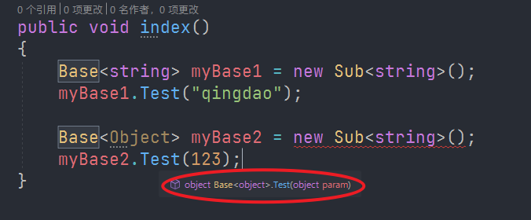
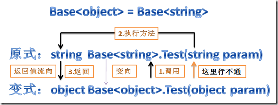

以下代码之所以不能编译通过，是因为
1. myBase2.Test(),需要传递进入一个 object类型的参数
2. 但实际执行的时候，是执行的 Sub.Test(string),他需要一个string类型的参数
3. 把 object 赋值给 string，这是违反 李氏替换原则的。

```JavaScript
Base<Object> myBase2 = new Sub<string>();
myBase2.Test(123);
```



下图说明更清楚
