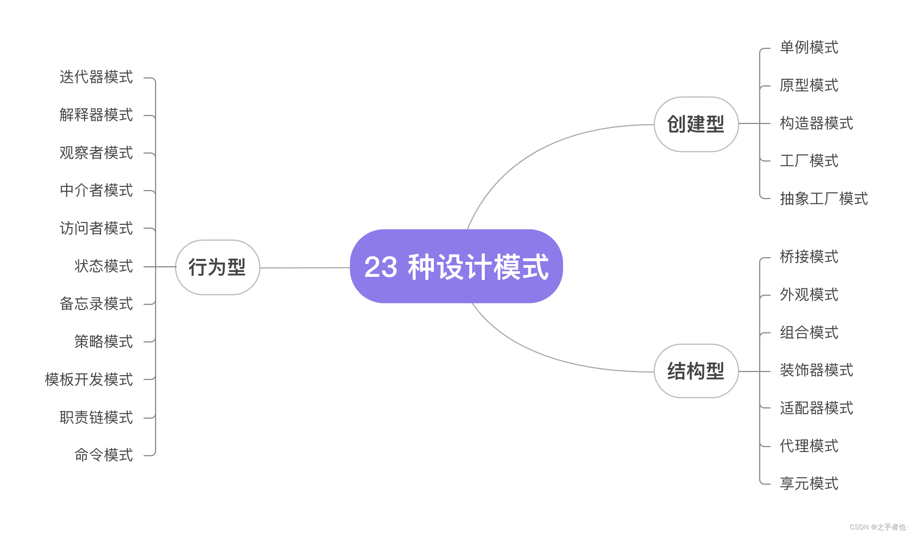

# 说明
## 总览图

## 设计模式的指导意义
设计模式是描述性的，而不是规定性的。当面对其他开发人员以前多次遇到的问题时，它们可以指导您，但并不是针对每个场景的生硬工具。本设计模式目录的目标是成为一个模式目录（用于提高意识）而不是一个清单（你必须做什么）。

## 模式与典型场景
- 状态模式：订单处理（订单的不同状态，可以执行的动作不同）
- 职责链：请假流程（请假条需要再部门层级间流转）
- 简单工厂：单一工厂。使用一个工厂生产所有的产品。
- 工厂方法：独立工厂。每个产品都有自己独立的工厂生产。
- 抽象工厂：组装电脑（电脑的各个组件需要分别生产，同时各个组件之间涉及配合问题（即他们是关联的））
- 反射工厂：动态加载实现逻辑的场景
- 创建者模式：生成复杂的对象实例。
- 观察者模式：报社发行报纸，读者订阅报纸
- 订阅发布模式：报社发行报纸，读者订阅报纸
- 中介者模式：电脑各部件全部通过主板这个中介进行交互。
- 外观模式：隐藏子系统的复杂性
- 原型模式：克隆现有对象
- 访问者模式：大忽悠公司，在人员固定的情况下不断开启新业务。
- 单例模式：启动应用程序（保证系统内只有一个应用被启动）

## ��参考资料：
- https://feixiang.blog.csdn.net/article/details/130573273