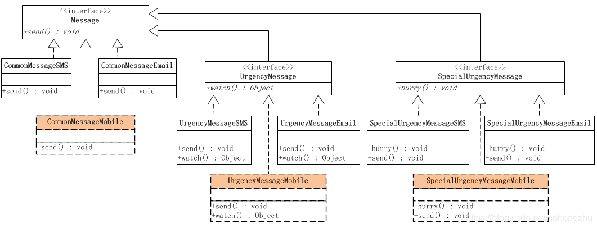

# 说明

观察上面的系统结构图，会发现一个很明显的问题，那就是通过这种继承的方式来扩展消息处理，会非常不方便。实现加急消息处理的时候，必须实现系统内短消息和邮件两种处理方式，因为业务处理可能不同，在实现特急消息处理的时候，又必须实现系统内短信息和邮件两种处理方式。这意味着，以后每次扩展一下消息处理，都必须要实现这两种处理方式，这还不算完，如果要添加新的实现方式呢？

如果要添加一种新的发送消息的方式，是需要在每一种抽象的具体实现中，都添加发送手机消息的处理的。也就是说，发送普通消息、加急消息和特急消息的处理，都可以通过手机来发送。

采用通过继承来扩展的实现方式，有个明显的缺点，扩展消息的种类不太容易。不同种类的消息具有不同的业务，也就是有不同的实现，在这种情况下，每一种类的消息，需要实现所有不同的消息发送方式。更可怕的是，如果要新加入一种消息的发送方式，那么会要求所有的消息种类都有加入这种新的发送方式的实现。

��参考资料：                        
* https://blog.csdn.net/aohongzhu/article/details/106206825