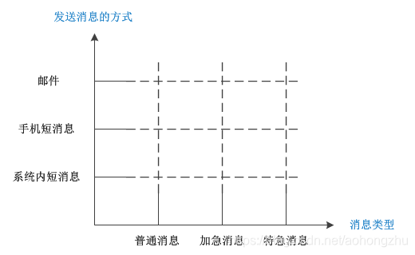

# 说明

根据业务的功能要求，业务的变化具有两个维度，一个维度是抽象的消息，包括普通消息、加急消息和特急消息，这几个抽象的消息本身就具有一定的关系，加急消息和特急消息会扩展普通消息；另一个维度是在具体的消息发送方式上，包括系统内短消息、邮件和手机短消息，这几个方式是平等的，可被切换的方式。

现在出现问题的根本原因，就在于消息的抽象和实现是混杂在一起的，这就导致了一个纬度的变化会引起另一个纬度进行相应的变化，从而使得程序扩展起来非常困难。

要想解决这个问题，就必须把这两个纬度分开，也就是将抽象部分和实现部分分开，让它们相互独立，这样就可以实现独立的变化，使扩展变得简单。抽象部分就是各个消息的类型所对应的功能，而实现部分就是各种发送消息的方式。按照桥梁模式的结构，给抽象部分和实现部分分别定义接口，然后分别实现它们就可以了。

观察本例会发现，采用桥梁模式来实现，抽象部分和实现部分分离开了，可以相互独立的变化，而不会相互影响。因此在抽象部分添加新的消息处理（特急消息），对发送消息的实现部分是没有影响的；反过来增加发送消息的方式（手机短消息），对消息处理部分也是没有影响的。