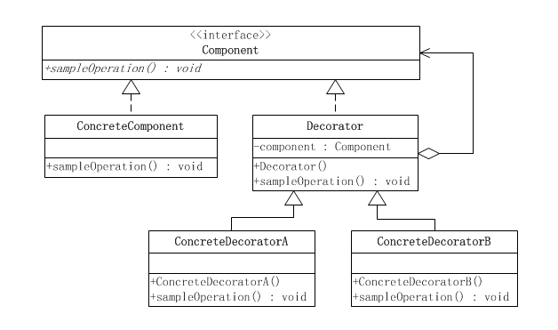
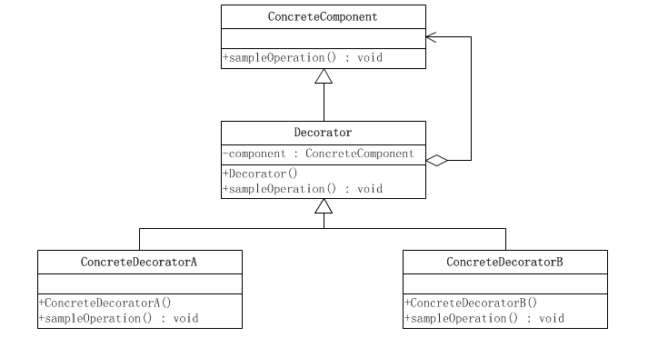

# 说明
1. 装饰器的作用是在不改变既有功能的前提下，为目标类型添加新的功能。
2. 装饰器的实现方式是既不改变原有类的功能，同时新装饰后的类对外暴漏的接口也跟原来的类型一致。
3. 因此装饰器的设计必选对原来的类型进行接口抽象，装饰器也要包含原来的类型。

# 类图
## 标准类图

## 简化类图
有些情况下，装饰器模式没有抽象的被装饰接口，只有一个具体的被装饰对象，这是就考虑去掉Component类(接口)，把Decorator作为一个ConcreteComponent的子类。
（注意：Decorator中的sampleOperation方法要调用的是component属性里面的sampleOperation方法，而不是基类里面的sampleOperation方法。）
