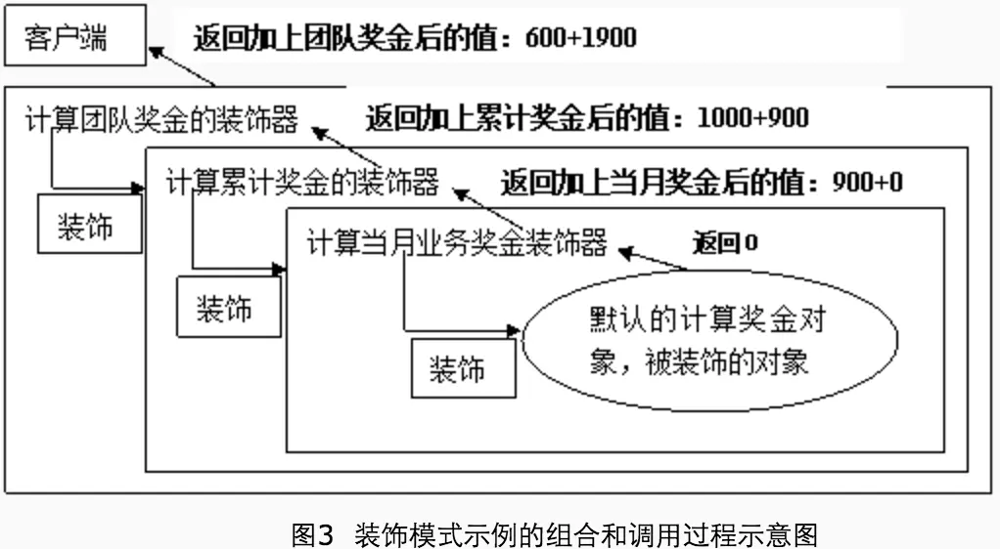

# 说明

在装饰模式的实现中，为了能够和原来使用被装饰对象的代码实现无缝结合，是通过定义一个抽象类，让这个类实现与被装饰对象相同的接口，然后在具体实现类里面，转调被装饰的对象，在转调的前后添加新的功能，这就实现了给被装饰对象增加功能，这个思路跟“对象组合”非常类似。

在转调的时候，如果觉得被装饰的对象的功能不再需要了，还可以直接替换掉，也就是不再转调，而是在装饰对象里面完全全新的实现。

## 本实例的图释
