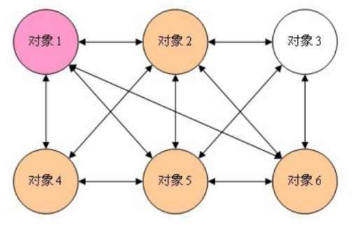
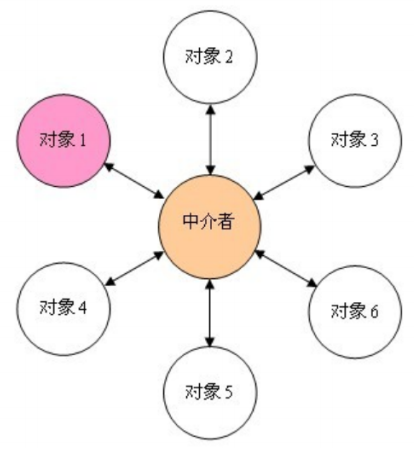

# 说明
## 使用场景
- 如果一组对象之间的通信方式比较复杂，导致相互依赖、结构混乱，可以采用中介者模式，把这些对象相互的交互管理起来，各个对象都只需要和中介者交互，从而使得各个对象松散耦合，结构也更清晰易懂。
- 如果一个对象引用很多的对象，并直接跟这些对象交互，导致难以复用该对象。可以采用中介者模式，把这个对象跟其它对象的交互封装到中介者对象里面，这个对象就只需要和中介者对象交互就可以了。

## 中介者模式的本质
将对象间的多对多关系，提取出来单独封装，变成一对多关系。
- 中介者模式引入前

- 中介者模式引入后

��中介者模式是用来降低多个对象和类之间的通信复杂性的。这种模式通过提供一个中介类，将系统各层次对象间的多对多关系编程一对多关系，中介者对象可以将复杂的网状结构变成以调停者为中心的星型结构，达到降低系统的复杂性，提高可扩展性的作用。

## 使用扩展
只要是实现封装对象之间的交互功能，就可以应用上中介者模式，而不必过于拘泥于中介者模式本身的结构。标准的中介者模式限制很多，导致能完全按照标准使用中介者模式的地方并不是很多，而且多集中在界面实现上。只要本质不变，稍稍变形一下，简化一下，或许能更好的使用中介者模式。（比如例子中的人员和部门之间的变化关系）

## ��参考资料：
- https://www.jianshu.com/p/531f1957219b