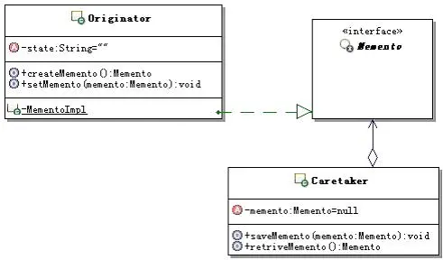

# 说明
- 备忘录模式，又叫快照模式（Snapshot Pattern）。
- Memento [məˈmentəʊ] n.纪念品，记忆碎片
- 导言诺兰有部电影就叫这个名字。

## 使用场景
备忘录模式的本质：保存和恢复内部状态。需要记录某个时刻某个对象（或者流程）的状态，以及在未来某个时刻需要恢复这个状态的场景，就可以使用备忘录模式。

## 功能
备忘录模式的功能，首先是在不破坏封装性的前提下，捕获一个对象的内部状态。这里要注意两点，一个是不破坏封装性，也就是对象不能暴露它不应该暴露的细节；另外一个是捕获的是对象的内部状态，而且通常还是运行期间某个时刻，对象的内部状态。

## 实现思路
在不破坏封装性的前提下，捕获一个对象的内部状态，并在该对象之外保存这个状态。这样以后就可将该对象恢复到原先保存的状态。

把要备忘的对象设置为原发对象的一个私有的内部类，这样外面只能通过备忘录对象的窄接口来获取备忘录对象，而这个接口没有任何方法，仅仅起到了一个标识对象类型的作用，从而保证内部的数据不会被外部获取或是操作，保证了原发器对象的封装性，也就不再暴露原发器对象的内部结构了。

## 结构图

## 示例说明
某系统会有多个运行阶段，第一阶段结束之后，在第二阶段会有多种运行方案。第二阶段的多种方案，都要尝试下，那么运行第二阶段的各个方案前，就要将第一阶段的运行结果进行保存和恢复。这种第一阶段状态的保存和恢复就是备忘录模式的运用场景。

## ▌参考资料：
- https://www.jianshu.com/p/714dc05feb12